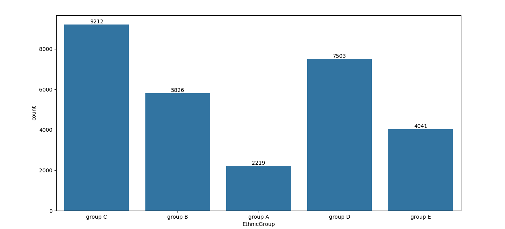
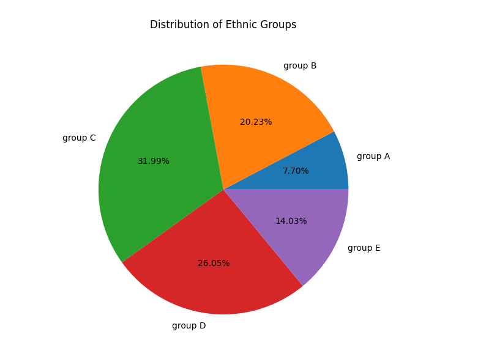
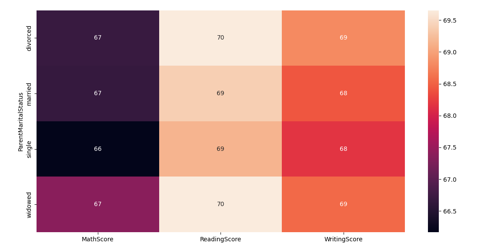
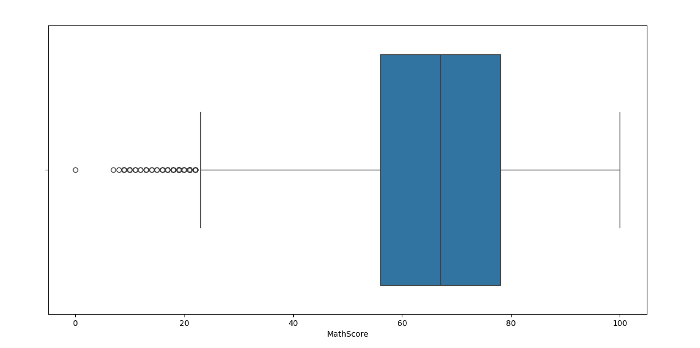

# Data-Analysis-of-students-performance


## Overview
This project analyzes student performance data to explore relationships between academic scores (Math, Reading, Writing) and various demographic factors such as ethnic group, parental education, and parental marital status. The analysis uses Python libraries including NumPy, Pandas, Matplotlib, and Seaborn to process data, generate visualizations, and derive insights.


## Tools and Modules 


## Dataset
The dataset (`Expanded_data_with_more_features.csv`) contains student information, including:
- Gender
- Ethnic Group
- Parental Education
- Parental Marital Status
- Weekly Study Hours
- Math, Reading, and Writing Scores
- Other features like test preparation and lunch type

## Analysis Objectives

 <div align="center">
  
</div>

- Examine the distribution of students across ethnic groups.
  
   <div align="center">
  
</div>

- Investigate the impact of parental education on average student scores.
  
  <div align="center">
  
</div>

- Analyze the influence of parental marital status on academic performance.
  
   <div align="center">
  
</div>

- Identify patterns in math scores using descriptive statistics and visualizations.
 

## Code Description
The Python script performs the following steps:
1. **Data Loading and Cleaning**:
   - Loads the dataset using Pandas.
   - Removes unnecessary columns (e.g., `Unnamed: 0`).
   - Corrects inconsistencies in the `WklyStudyHours` column (e.g., replaces "05-Odt" with "5-10").
   - Checks for missing values and provides dataset summary statistics.

2. **Exploratory Data Analysis (EDA)**:
   - Displays the first few rows and basic information about the dataset.
   - Identifies unique ethnic groups and their counts.
   - Calculates the distribution of students across ethnic groups.

3. **Visualizations**:
   - **Count Plot**: Shows the distribution of students by ethnic group with counts labeled on bars.
   - **Heatmaps** (commented): Aggregates mean scores by parental education and marital status.
   - **Box Plot** (commented): Visualizes the distribution of math scores.
   - **Pie Chart** (commented): Displays the percentage distribution of ethnic groups.

## Libraries Used
- NumPy: For numerical computations.
- 
- Pandas: For data manipulation and analysis.
- 
- Matplotlib: For creating static visualizations.
- Seaborn: For enhanced statistical visualizations.

## How to Run
1. Ensure Python and required libraries are installed:
   ```bash
   pip install numpy pandas matplotlib seaborn
   ```
2. Place the dataset (`Expanded_data_with_more_features.csv`) in the same directory as the script.
3. Run the Python script:
   ```bash
   python script.py
   ```
4. Visualizations will be displayed, and console output will show dataset details.

## Results
- **Ethnic Group Distribution**: A count plot visualizes the number of students in each ethnic group (A, B, C, D, E).
- **Parental Education and Marital Status**: Heatmaps (if uncommented) reveal average scores across these factors, highlighting potential correlations.
- **Math Score Insights**: A box plot (if uncommented) shows the spread and outliers in math scores.
- **Pie Chart**: A commented pie chart provides a percentage breakdown of ethnic groups.


## Future Improvements
- Handle missing values more robustly (e.g., imputation or exclusion strategies).
- Add statistical tests to validate observed trends.
- Include more interactive visualizations using libraries like Plotly.
- Explore additional features like test preparation or lunch type for deeper insights.

## License
This project is for educational purposes and uses publicly available data. Ensure compliance with any dataset-specific licensing terms.

